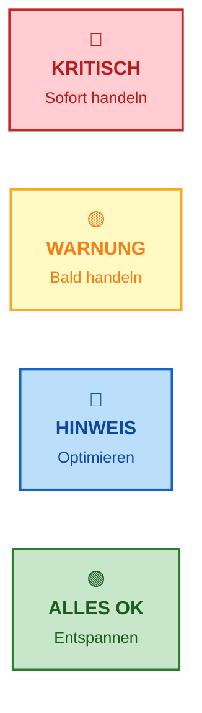
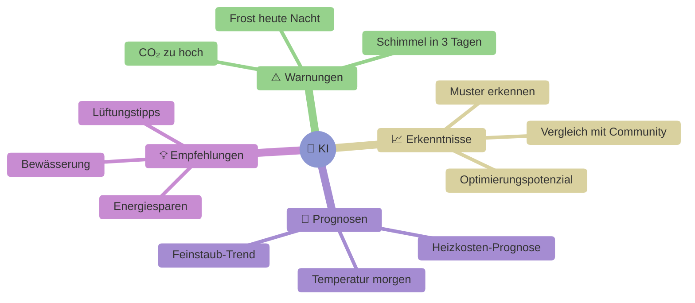
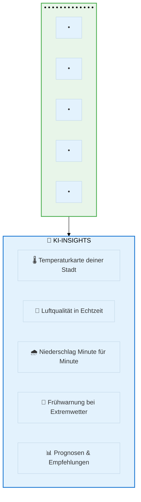
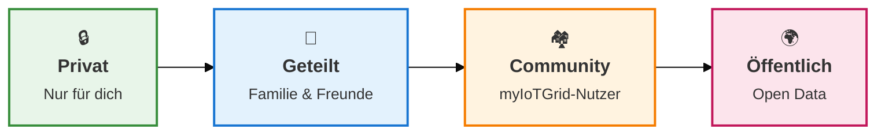
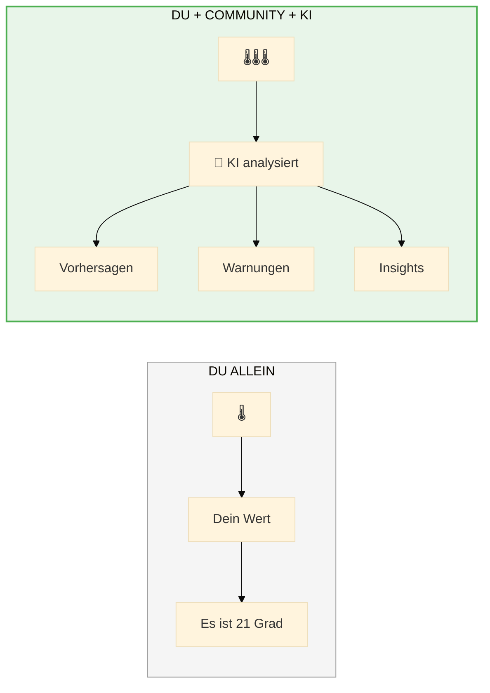
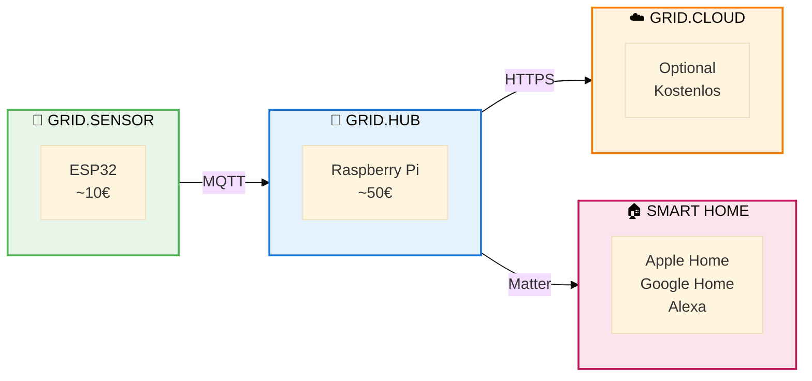
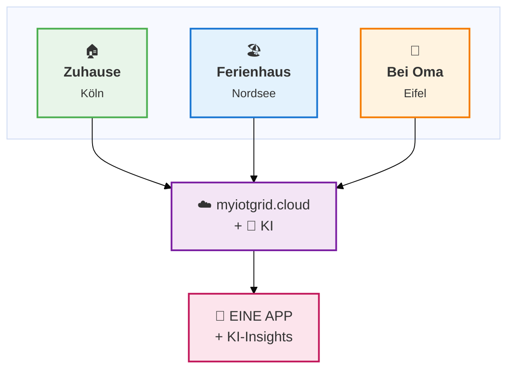
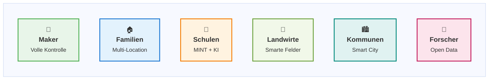
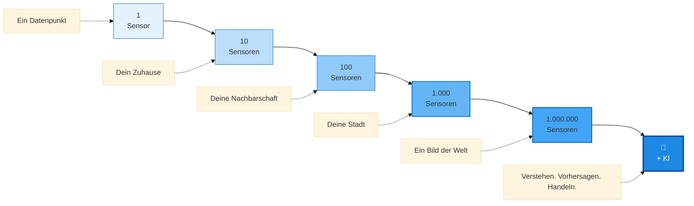

<p align="center">
  <br>
</p>

<h1 align="center">🌐 myIoTGrid</h1>

<h3 align="center">Aus vielen Punkten entsteht ein Bild.<br>Gemeinsam machen wir die Welt ein bisschen smarter.</h3>

<br>

<p align="center">
  <a href="https://myiotgrid.cloud">🌐 Website</a>
  &nbsp;&nbsp;·&nbsp;&nbsp;
  <a href="https://mysocialcare-doku.atlassian.net/wiki/spaces/myIoTGrid">📖 Dokumentation</a>
  &nbsp;&nbsp;·&nbsp;&nbsp;
  <a href="#-schnellstart">🚀 Schnellstart</a>
</p>

<p align="center">
  
  
  
  
</p>

<br>

---

<br>

## 💡 Die Idee

**Stell dir vor:**

Du schaust morgens auf dein Smartphone und siehst nicht nur die Temperatur in deinem Wohnzimmer – du siehst das **Mikroklima deiner gesamten Nachbarschaft**. Du weißt, dass es im Park um die Ecke 2 Grad kühler ist. Du siehst, dass die Luftqualität an der Hauptstraße heute schlecht ist. Du bekommst eine Warnung, dass der Fluss in deiner Region steigt.

**Und dann sagt dir eine KI:**

> *„Basierend auf der Wettervorhersage und deinen Kellerdaten der letzten 30 Tage: Schimmelrisiko steigt. Empfehlung: Heute 2x stoßlüften."*

Diese Daten kommen nicht von einer teuren Wetterstation oder einer Behörde. **Sie kommen von Menschen wie dir.** Von deinem Nachbarn, der einen Sensor im Garten hat. Von der Schule nebenan, die ihre Luftqualitätsdaten teilt. Von Tausenden anderen, die ihre kleinen Messpunkte zu einem großen Bild zusammenfügen.

**Die KI macht aus diesem Bild Wissen.**

**Das ist myIoTGrid.**

<br>

---

<br>

## 🤖 Built with AI – Powered by AI

**myIoTGrid ist von Anfang an ein KI-natives Projekt.**

KI ist nicht nur ein Feature, das später dazukommt – **KI steckt in der DNA des gesamten Projekts:**

| Aspekt | Wie KI zum Einsatz kommt |
|--------|--------------------------|
| 🛠️ **Entwicklung** | Konzeption, Architektur und Code entstehen mit KI-Unterstützung |
| 📊 **Datenanalyse** | KI erkennt Muster, Anomalien und Zusammenhänge in deinen Sensordaten |
| ⚠️ **Frühwarnsystem** | KI-basierte Warnstufen und Vorhersagen für kritische Ereignisse |
| 🔮 **Prognosen** | Vorhersage von Trends basierend auf historischen Daten |
| 💡 **Insights** | Automatische Erkenntnisse und Handlungsempfehlungen |

<br>

### KI-Warnstufen



| Stufe | Bedeutung | Beispiel |
|-------|-----------|----------|
| 🔴 **Kritisch** | Sofortiges Handeln erforderlich | Wasserschaden erkannt, CO₂ gefährlich hoch |
| 🟡 **Warnung** | Aufmerksamkeit erforderlich | Schimmelrisiko, Frostgefahr, schlechte Luft |
| 🔵 **Hinweis** | Optimierungspotenzial | Lüftungsempfehlung, Energiespartipp |
| 🟢 **OK** | Alles im grünen Bereich | Optimales Klima |

<br>

### Was die KI für dich tut



<br>

---

<br>

## 🌍 Aus vielen Punkten entsteht ein Bild



<br>

**Ein Sensor allein ist ein Datenpunkt.**  
**Zehn Sensoren zeigen dein Zuhause.**  
**Hundert Sensoren zeigen deine Nachbarschaft.**  
**Tausend Sensoren zeigen deine Stadt.**  
**Eine Million Sensoren zeigen ein Bild unserer Welt.**  
**KI macht aus diesem Bild Wissen und Vorhersagen.**

<br>

---

<br>

## 🔄 Nicht nur geben – auch empfangen!

Das unterscheidet myIoTGrid von allem anderen:

<br>

### Du gibst 📤

Teile deine Sensordaten – **wenn du willst, mit wem du willst:**



<br>

### Du empfängst 📥

Aber du bekommst auch etwas zurück!

| Quelle | Was du bekommst | Umfang |
|--------|-----------------|--------|
| 👥 **Community-Sensoren** | Daten von anderen myIoTGrid-Nutzern | Wächst täglich |
| 🌐 **Sensor.Community** | Feinstaub, Temperatur, Lärm | **34.000+ Sensoren weltweit** |
| ☁️ **OpenWeatherMap** | Wetter, Vorhersagen, UV-Index | Global |
| 🇩🇪 **DWD Open Data** | Offizielle Wetterwarnungen | 2.000+ Stationen |
| 💨 **OpenAQ** | Luftqualität weltweit | 10.000+ Stationen |
| 🤖 **KI-Insights** | Analysen, Warnungen, Prognosen | **Automatisch** |

<br>

**Du wählst, was du siehst. Du entscheidest, was du teilst. Die KI hilft dir, es zu verstehen.**

<br>

---

<br>

## 🤝 Das Sharing-Prinzip

### Privacy First – Sharing Second

Jeder Sensor ist **standardmäßig privat**. Punkt.

Du musst nichts teilen. Du kannst myIoTGrid komplett offline nutzen, nur für dich, ohne dass jemals ein Datenpunkt dein Zuhause verlässt.

**Aber wenn du teilst, passiert Magie:**



<br>

### Granulare Kontrolle

Für jede Freigabe entscheidest **du**:

- ✅ **Echtzeit-Daten** – Immer dabei
- ⚙️ **Historische Daten** – Optional
- ⚙️ **Standort** – Optional
- ⚙️ **Metadaten** – Optional
- ⏰ **Ablaufdatum** – Optional (befristete Freigabe)

<br>

---

<br>

## 🏗️ Die drei Komponenten



<br>

### 📡 Grid.Sensor – Die Augen

ESP32-basierte Mikrocontroller, die Umweltdaten erfassen.

- **Hardware:** ESP32 NodeMCU (~5€), ESP32-C3, ESP8266
- **Sensoren:** Temperatur, Luftfeuchte, CO₂, Feinstaub, Licht, Bodenfeuchte, ...
- **Kosten:** Ab ~10-15€ pro Sensor komplett

<br>

### 🧠 Grid.Hub – Das Gehirn

Lokale Zentrale, die alles zusammenführt.

- **Hardware:** Raspberry Pi 4/5, alter PC, Docker
- **Software:** .NET 8, Angular, SQLite
- **🤖 Edge-KI:** Lokale Anomalie-Erkennung – **funktioniert auch offline!**
- **Matter-Bridge** zu Apple Home, Google Home, Alexa

<br>

### ☁️ Grid.Cloud – Das Netzwerk

Optionale Cloud für Community-Features unter **myiotgrid.cloud**

- **Software:** .NET 10, Angular, PostgreSQL
- **🤖 Cloud-KI:** Mächtige Analysen über alle Daten
- **Community Map** mit allen geteilten Sensoren
- **KI-Insights, Warnungen, Prognosen**

<br>

---

<br>

## 📍 Sensoren überall – Ein Dashboard



<br>

| Kategorie | Beispiele |
|-----------|-----------|
| 🏠 **Zuhause** | Wohnzimmer, Schlafzimmer, Keller, Dachboden, Garage |
| 🌳 **Outdoor** | Garten, Balkon, Terrasse, Gewächshaus, Pool |
| 🏖️ **Remote** | Ferienhaus, Zweitwohnung, Elternhaus |
| 🏫 **Bildung** | Schulen, Kindergärten, Unis |
| 🌾 **Landwirtschaft** | Felder, Weinberge, Obstplantagen, Bienenstöcke |
| 🔬 **Spezial** | Aquarium, Terrarium, Weinkeller, Sauna |

<br>

---

<br>

## 🎯 Für wen ist myIoTGrid?



<br>

| Zielgruppe | Warum myIoTGrid? |
|------------|------------------|
| 🔧 **Maker** | *„Endlich eine Plattform, die mich nicht einsperrt – und KI gibt's gratis dazu!"* |
| 🏠 **Familien** | *„Ferienhaus, Oma's Haus, Zuhause – die KI passt auf alles auf."* |
| 🏫 **Schulen** | *„MINT + KI zum Anfassen – und die Daten bleiben bei uns!"* |
| 🌾 **Landwirte** | *„Die KI sagt mir, wann ich gießen muss – und wann nicht."* |
| 🏙️ **Kommunen** | *„KI findet Hitze-Inseln, bevor Menschen leiden."* |
| 🔬 **Forscher** | *„34.000 Sensoren + KI = echte Klimaforschung."* |

<br>

---

<br>

## 🌍 Die Vision: Von Smart Home zu Smart World



<br>

**Jeder Sensor zählt. Jeder Beitrag hilft. Jeder Punkt vervollständigt das Bild.**  
**KI macht aus diesem Bild Wissen.**

<br>

Was wäre, wenn wir wüssten, wo in unserer Stadt **Hitze-Inseln** entstehen?  
Was wäre, wenn Schulen ihre **Luftqualität** teilen würden?  
Was wäre, wenn Landwirte gemeinsam das **Mikroklima** ihrer Region verstehen könnten?  
Was wäre, wenn eine KI all diese Daten analysiert und uns **warnt, bevor etwas passiert**?

**Das ist die Vision von myIoTGrid.**

<br>

---

<br>

## 🚀 Schnellstart

**In 5 Minuten live.**

<br>

### 1️⃣ Hub starten

```bash
docker run -d --name myiotgrid \
  -p 5000:5000 -p 1883:1883 \
  ghcr.io/myiotgrid/hub:latest
```

### 2️⃣ Sensor flashen

```bash
cd grid-sensor
cp config.example.h config.h
# WiFi + Hub-IP eintragen
pio run --target upload
```

### 3️⃣ Dashboard öffnen

```
http://localhost:5000
```

**Das war's. 🎉**

<br>

---

<br>

## 📜 100% Open Source – MIT-Lizenz

**Keine Einschränkungen. Keine versteckten Kosten. Für immer frei.**

| Du darfst... | |
|--------------|---|
| Kostenlos nutzen | ✅ |
| Code anschauen | ✅ |
| Verändern und erweitern | ✅ |
| Kommerziell einsetzen | ✅ |
| KI-Modelle trainieren | ✅ |
| Forken und weiterentwickeln | ✅ |

**Warum?** Weil wir glauben, dass **Umweltdaten** allen gehören sollten. Weil wir glauben, dass **KI** für alle da sein sollte – nicht nur für Big Tech. Weil wir glauben, dass eine **Community** mehr erreicht als ein Unternehmen.

<br>

---

<br>

## 🎯 Mach mit!

**myIoTGrid startet beim SmartCity Hackathon 2025.**

<br>

Wir suchen:

- 🔧 **Entwickler** – Backend, Frontend, Embedded
- 🤖 **KI/ML-Engineers** – Modelle, Analysen, Vorhersagen
- 🎨 **Designer** – UI/UX für Dashboard und Mobile
- 📡 **Hardware-Enthusiasten** – Sensoren bauen und testen
- 📝 **Dokumentations-Talente** – Anleitungen schreiben
- 🌍 **Community-Builder** – Das Netzwerk wachsen lassen

<br>

```bash
git clone https://github.com/myiotgrid/myiotgrid.git
cd myiotgrid
# Los geht's! 🚀
```

<br>

---

<br>

<p align="center">
  <strong>Aus vielen Punkten entsteht ein Bild.</strong><br>
  <strong>KI macht aus diesem Bild Wissen.</strong><br>
  <strong>Gemeinsam machen wir die Welt ein bisschen smarter.</strong>
</p>

<br>

<p align="center">
  <a href="https://myiotgrid.cloud"><strong>🌐 myiotgrid.cloud</strong></a>
</p>

<p align="center">
  Open Source · Community Driven · Privacy First · AI Native
</p>

<br>

<p align="center">
  <sub>Made with ❤️ and 🤖 in Germany</sub>
</p>

<br>
