<p align="center">
  <br><br>
</p>

<h1 align="center">🌐 myIoTGrid</h1>

<h3 align="center">Dein Zuhause. Intelligent.</h3>

<p align="center">
  <em>Die erste IoT-Plattform, die mitdenkt.</em>
</p>

<br>

<p align="center">
  <a href="https://myiotgrid.cloud">Website</a>
  &nbsp;&nbsp;·&nbsp;&nbsp;
  <a href="https://mysocialcare-doku.atlassian.net/wiki/spaces/myIoTGrid">Dokumentation</a>
  &nbsp;&nbsp;·&nbsp;&nbsp;
  <a href="#-schnellstart">Schnellstart</a>
</p>

<p align="center">
  
  
  
  
</p>

<br><br>

---

<br>

<h2 align="center">Sensoren sammeln Daten.<br><strong>myIoTGrid versteht sie.</strong></h2>

<br>

```mermaid
%%{init: {'theme': 'base', 'themeVariables': { 'primaryColor': '#e8f5e9', 'primaryTextColor': '#1b5e20', 'primaryBorderColor': '#4caf50', 'lineColor': '#81c784', 'secondaryColor': '#fff3e0', 'tertiaryColor': '#e3f2fd'}}}%%

block-beta
    columns 3
    
    block:vorher:1
        columns 1
        A["😕 VORHER"]
        B["Temperatur: 18.5°C"]
        C["Luftfeuchte: 73%"]
        D["CO₂: 892 ppm"]
        E["\"Okay... und?\""]
    end
    
    space
    
    block:nachher:1
        columns 1
        F["🤖 MIT myIoTGrid"]
        G["🟡 Lüften in 12 Min"]
        H["🟢 Keller optimal"]  
        I["🔵 Energiespartipp"]
        J["\"Verstanden!\""]
    end
```

<br><br>

---

<br>

<h2 align="center">Die Architektur</h2>

<p align="center"><em>Drei Komponenten. Ein System.</em></p>

<br>

```mermaid
%%{init: {'theme': 'base', 'themeVariables': { 'primaryColor': '#f3e5f5', 'primaryTextColor': '#4a148c', 'primaryBorderColor': '#9c27b0', 'lineColor': '#ba68c8', 'secondaryColor': '#e8f5e9', 'tertiaryColor': '#e3f2fd'}}}%%

flowchart LR
    subgraph SENSOR ["📡 GRID.SENSOR"]
        S1["🌡️ Temperatur"]
        S2["💧 Feuchte"]
        S3["💨 CO₂"]
        S4["🌱 Boden"]
    end
    
    subgraph HUB ["🧠 GRID.HUB"]
        H1["📊 Dashboard"]
        H2["🤖 Edge-KI"]
        H3["💾 SQLite"]
        H4["🏠 Matter"]
    end
    
    subgraph CLOUD ["☁️ GRID.CLOUD"]
        C1["🗺️ Community Map"]
        C2["🤖 Cloud-KI"]
        C3["🤝 Sharing"]
        C4["📡 Open API"]
    end
    
    SENSOR -->|MQTT| HUB
    HUB -->|HTTPS| CLOUD
    
    style SENSOR fill:#e8f5e9,stroke:#4caf50,stroke-width:2px
    style HUB fill:#e3f2fd,stroke:#2196f3,stroke-width:2px
    style CLOUD fill:#fff3e0,stroke:#ff9800,stroke-width:2px
```

<br>

<table align="center">
<tr>
<td align="center" width="33%">

### 📡 Grid.Sensor

**ESP32 · Ab 10€**

Misst alles. Überall.

</td>
<td align="center" width="33%">

### 🧠 Grid.Hub

**Raspberry Pi · ~50€**

Denkt mit. Auch offline.

</td>
<td align="center" width="33%">

### ☁️ Grid.Cloud

**Optional · Kostenlos**

Verbindet. Wenn du willst.

</td>
</tr>
</table>

<br><br>

---

<br>

<h2 align="center">KI, die für dich arbeitet</h2>

<p align="center"><em>Nicht irgendwann. Von Anfang an.</em></p>

<br>

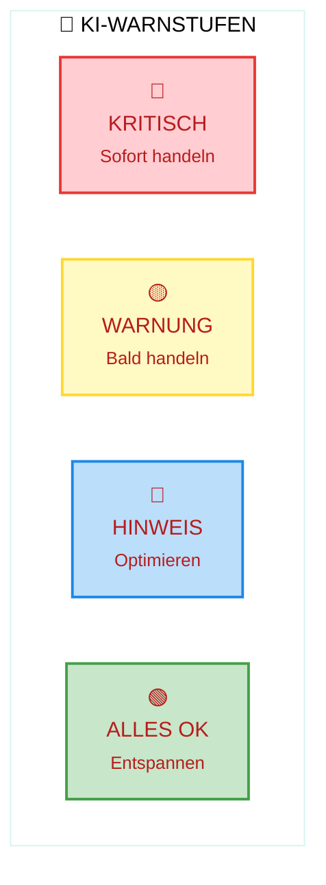

<br>

<p align="center">
  <strong>Schimmelwarnung.</strong> 3 Tage bevor du ihn siehst.<br><br>
  <strong>Frostgefahr.</strong> 12 Stunden bevor es kalt wird.<br><br>
  <strong>Luftqualität.</strong> Bevor du Kopfschmerzen bekommst.
</p>

<br><br>

---

<br>

<h2 align="center">Was die KI kann</h2>

<br>

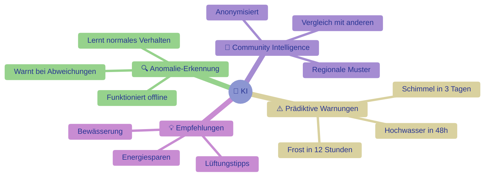

<br><br>

---

<br>

<h2 align="center">Privatsphäre ist kein Feature.<br>Es ist das Fundament.</h2>

<br>

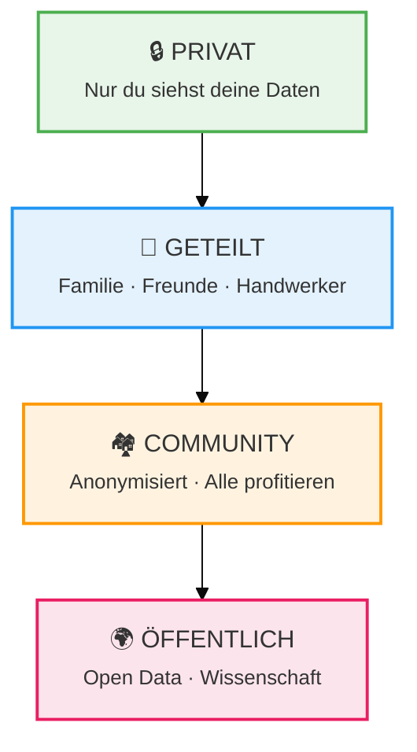

<br>

<p align="center">
  <em>Jeder Sensor startet privat.<br>Teilen ist immer deine Entscheidung.</em>
</p>

<br><br>

---

<br>

<h2 align="center">Je mehr mitmachen,<br>desto schlauer für alle.</h2>

<br>

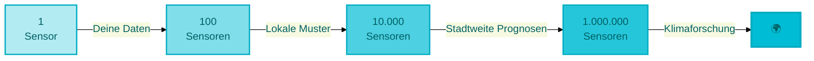

<br>

<p align="center">
  <strong>Community Intelligence.</strong><br>
  <em>Die KI lernt von allen. Ohne individuelle Daten preiszugeben.</em>
</p>

<br><br>

---

<br>

<h2 align="center">Smart Home Integration</h2>

<br>

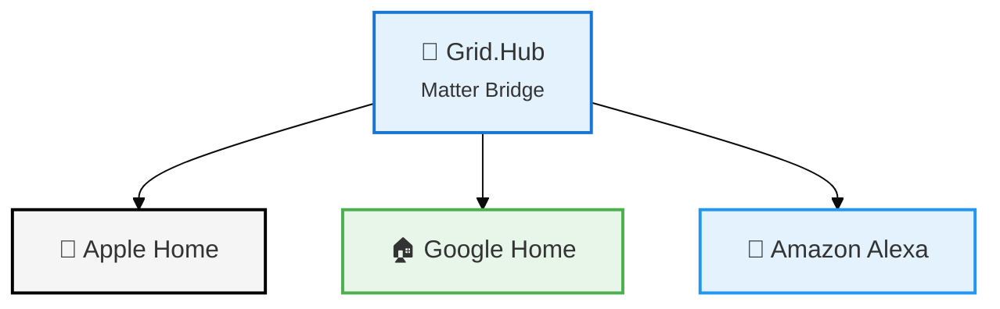

<br>

<p align="center">
  <em>Via <strong>Matter</strong> – dem neuen Smart-Home-Standard.</em>
</p>

<br><br>

---

<br>

<h2 align="center">Sensoren für alles</h2>

<br>

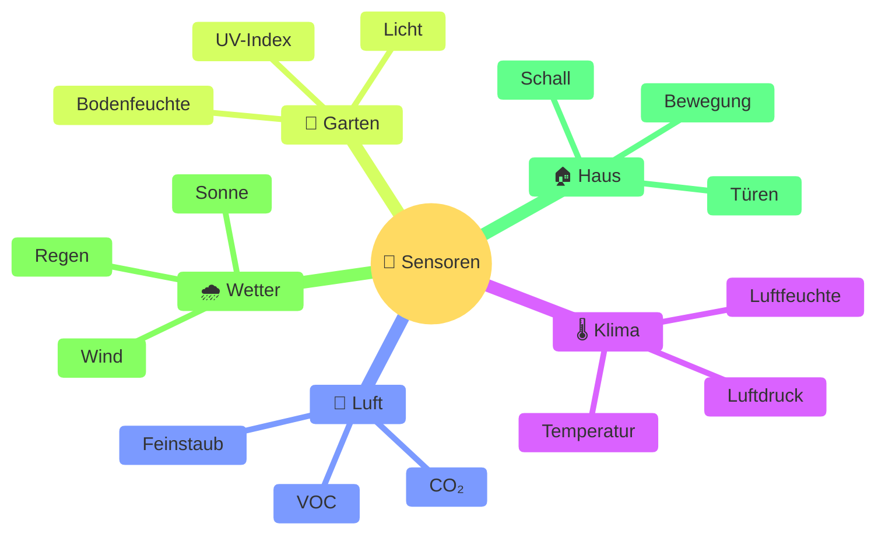

<br>

<p align="center">
  <strong>+ 34.000 externe Sensoren</strong><br>
  <em>Sensor.Community · OpenWeather · DWD</em>
</p>

<br><br>

---

<br>

<h2 align="center">Für alle, die mehr wollen</h2>

<br>

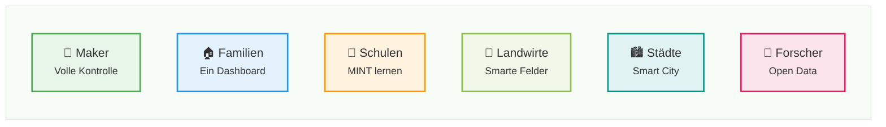

<br><br>

---

<br>

<h2 align="center">Roadmap</h2>

<br>

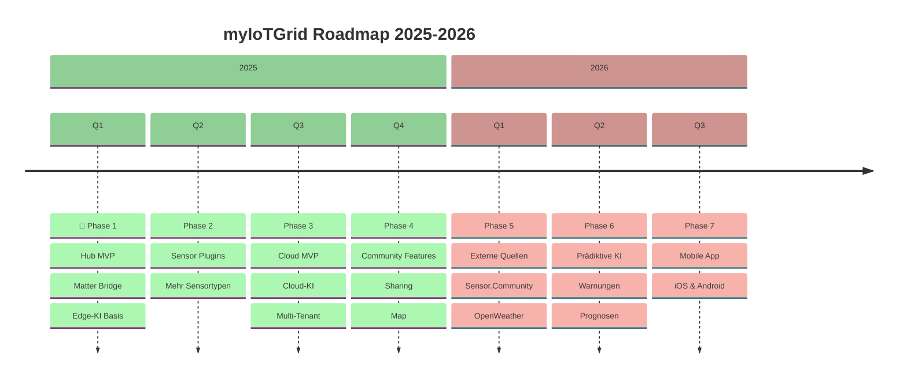

<br><br>

---

<br>

<h2 align="center">🚀 Schnellstart</h2>

<p align="center"><em>In 5 Minuten live.</em></p>

<br>

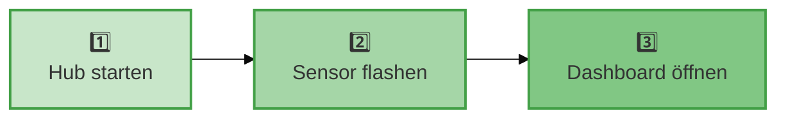

<br>

### 1️⃣ Hub starten

```bash
docker run -d --name myiotgrid \
  -p 5000:5000 -p 1883:1883 \
  ghcr.io/myiotgrid/hub:latest
```

### 2️⃣ Sensor verbinden

```bash
cd grid-sensor && pio run --target upload
```

### 3️⃣ Dashboard öffnen

```
http://localhost:5000
```

<br>

<p align="center"><strong>Das war's.</strong></p>

<br><br>

---

<br>

<h2 align="center">Technologie</h2>

<br>

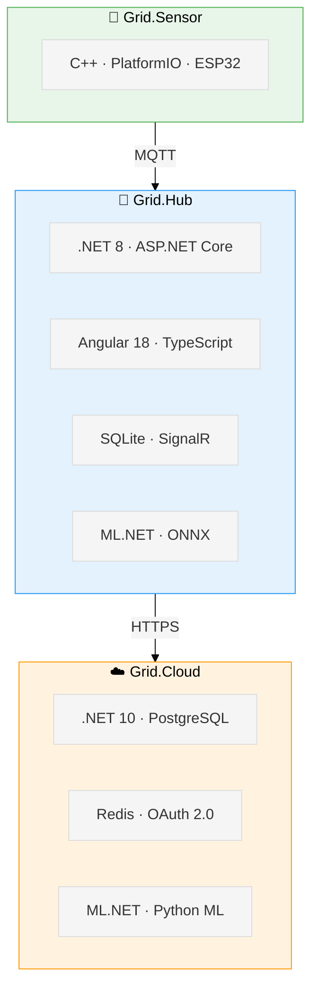

<br><br>

---

<br>

<h2 align="center">Open Source. Für immer.</h2>

<br>

<p align="center">
  <strong>MIT License</strong>
</p>

<p align="center">
  <em>Keine Einschränkungen. Keine versteckten Kosten. Keine Abhängigkeit.</em>
</p>

<br>

> [!NOTE]
> **Warum MIT?**
> 
> 🌍 Weil **Umweltdaten** allen gehören sollten.
> 
> 🤖 Weil **KI** für alle da sein sollte – nicht nur für Big Tech.
> 
> 🤝 Weil eine **Community** mehr erreicht als ein Unternehmen.

<br><br>

---

<br>

<h2 align="center">Mitmachen</h2>

<br>

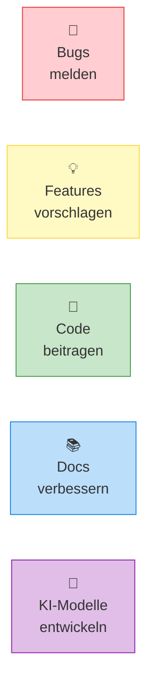

<br>

```bash
git clone https://github.com/myiotgrid/myiotgrid.git
cd myiotgrid
# Los geht's! 🚀
```

<br><br>

---

<br><br>

<p align="center">
  <strong>myIoTGrid</strong>
</p>

<p align="center">
  Open Source · Privacy First · AI Native
</p>

<p align="center">
  <a href="https://github.com/myiotgrid/myiotgrid">GitHub</a>
  &nbsp;·&nbsp;
  <a href="https://myiotgrid.cloud">Website</a>
  &nbsp;·&nbsp;
  <a href="https://mysocialcare-doku.atlassian.net/wiki/spaces/myIoTGrid">Docs</a>
</p>

<br>

<p align="center">
  <sub>Made with ❤️ in Germany</sub>
</p>

<br><br>
