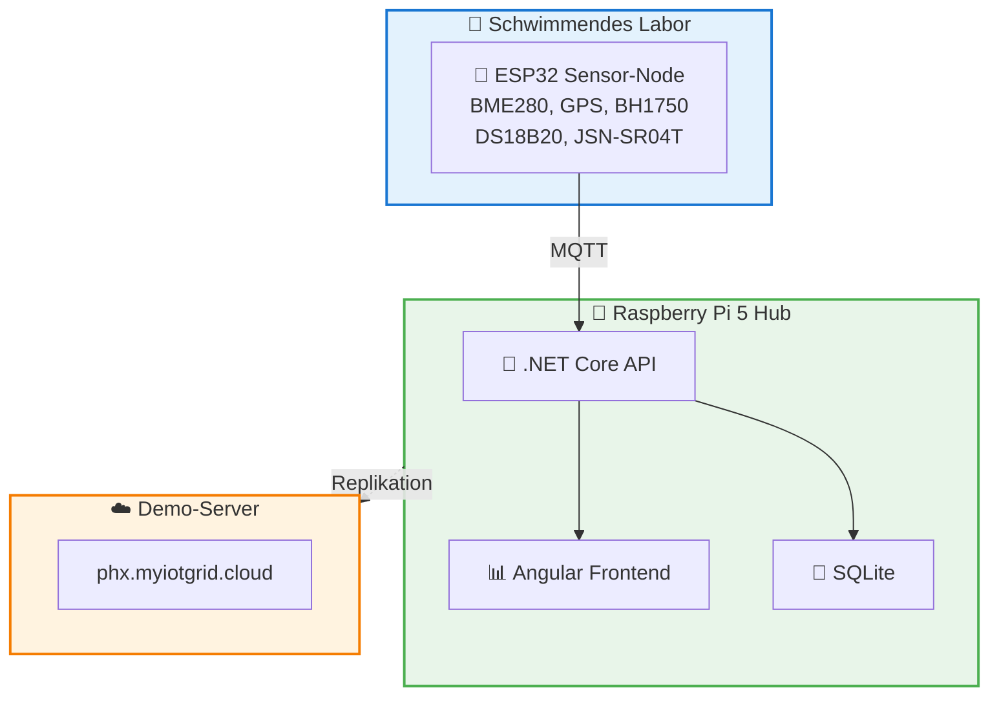

<p align="center">
  <br>
</p>

<h1 align="center">🌊 myIoTGrid.Phx</h1>

<h3 align="center">Schwimmendes IoT-Labor zur Wasserqualitätsmessung im Fluss Erft</h3>

<br>

<p align="center">
  <a href="https://phx.myiotgrid.cloud">🚀 Live Demo</a>
  &nbsp;&nbsp;·&nbsp;&nbsp;
  <a href="https://myiotgrid.atlassian.net/wiki/spaces/HackAThon/overview">📖 Dokumentation</a>
  &nbsp;&nbsp;·&nbsp;&nbsp;
  <a href="https://github.com/myiotgrid/myiotgrid">🌐 myIoTGrid (Hauptprojekt)</a>
</p>

<p align="center">
  
  
  
</p>

<br>

---

<br>

## 📖 Über dieses Projekt

**myIoTGrid.Phx** ist ein spezialisierter Fork des [myIoTGrid-Projekts](https://github.com/myiotgrid/myiotgrid), entwickelt für einen Hackathon am Pascal-Gymnasium Grevenbroich.

Das Projekt verbindet Bildung mit praktischer Umwelttechnik: Ein schwimmendes IoT-Labor misst Wasserqualitätsdaten im Fluss Erft und macht komplexe IoT-Konzepte für Schüler der 10. Klasse und deren Eltern greifbar.

<br>

## 🌐 Live Demo & Dokumentation

**🚀 Probiere das System aus:**  
Die aktuelle Demo-Installation ist online erreichbar unter **[https://phx.myiotgrid.cloud](https://phx.myiotgrid.cloud)**

**📖 Vollständige Dokumentation:**  
Alle technischen Details, Anleitungen und Konzepte findest du in Confluence:  
**[myIoTGrid.Phx Dokumentation](https://myiotgrid.atlassian.net/wiki/x/S4Ee)**

<br>

## 🎯 Die Entstehung

Beim Hackathon am Pascal-Gymnasium entstand die Idee, Wasserqualität direkt am Fluss zu messen. Daraus entwickelte sich ein vollständiges IoT-System:

**Hardware:**
- Schwimmende Sensorplattform (Boot) gebaut aus recycelten PET-Flaschen
- ESP32-basierter Sensor-Node mit sechs verschiedenen Sensoren
- Messungen: **Lufttemperatur**, **Luftfeuchtigkeit**, **Luftdruck**, **GPS-Position und -Geschwindigkeit**, **Wassertemperatur**, **Lichtstärke**, **Wassertiefe**
- Raspberry Pi 5 als lokaler Hub mit Access Point (funktioniert komplett offline)

**Software:**
- .NET Core Backend API für Datenverwaltung
- Angular Frontend für Visualisierung
- Docker-Container für einfache Bereitstellung
- SSL-verschlüsselte Kommunikation

<br>

## 🏗️ System-Architektur



<br>

## 🛶 Das schwimmende Labor

PhX1 ist kein gewöhnliches Boot - es ist ein schwimmendes Umweltlabor, das mit der Strömung der Erft treibt und dabei kontinuierlich Messdaten erfasst.

### Aufbau

```
                 ┌─────────────────────────────────┐
                 │  Wasserdichte Elektronik-Box    │
                 │  mit ESP32 & Sensoren            │
                 └─────────────────────────────────┘
                               │
    ══════════════════════════════════════════════════  ← Bodenplatte
      ╱   🍾      🍾      🍾      🍾      🍾      🍾    ╲   ← PET-Flaschen
   ════════════════════════════════════════════════════
              │                        │
         Wassertemp               Tiefensensor
         
    ←←← Bergungsschnur ←←←
```

### Konstruktionsprinzip

- **Schwimmkörper:** Recycelte PET-Flaschen (1,5-2L) als umweltfreundliche Auftriebskörper
- **Basis:** Stabile Bodenplatte (ca. 30x50cm) für sichere Montage
- **Elektronik-Box:** Wasserdichte Box mit Klarsichtdeckel schützt alle elektronischen Komponenten
- **Sensoren:** Wasserdichte Sensoren (DS18B20, JSN-SR04T) tauchen ins Wasser
- **Bergung:** Reißfeste Schnur (15-20m) zum sicheren Zurückholen nach der Messfahrt

### Messfahrt-Ablauf

1. **Start:** PhX1 wird von einer Brücke ins Wasser gelassen - die Messung startet automatisch
2. **Drift:** Das Boot treibt frei mit der Strömung und erfasst alle paar Sekunden Daten
3. **Live-Tracking:** GPS-Position wird in Echtzeit übertragen
4. **Bergung:** Nach der Messfahrt wird PhX1 an der Schnur zurückgezogen

**Besonderheit:** Da das Boot frei treibt, entspricht seine GPS-gemessene Geschwindigkeit exakt der Fließgeschwindigkeit der Erft!

<br>

## 🔧 Technische Details

### Hardware-Komponenten

Das PhX1-Boot ist mit folgenden Sensoren ausgestattet:

| Komponente | Beschreibung | Was wird gemessen |
|------------|--------------|-------------------|
| **ESP32 Mikrocontroller** | Herzstück des Sensor-Boots | Datenerfassung und Übertragung |
| **GY-BME280** | Umweltsensor | Lufttemperatur, Luftfeuchtigkeit, Luftdruck |
| **DS18B20** | Wasserdichter Temperatursensor | Wassertemperatur |
| **BH1750** | Lichtsensor | Lichtstärke/Helligkeit |
| **GPS NEO-6M** | GPS-Modul mit Antenne | GPS-Position und Geschwindigkeit |
| **JSN-SR04T** | Ultraschall-Sensor | Wassertiefe |
| **Raspberry Pi 5** | Mini-Computer | Lokaler Hub und Access Point |

### Software-Stack

| Komponente | Technologie | Version |
|------------|-------------|---------|
| **Backend API** | .NET Core | 10.0 |
| **Frontend** | Angular | Aktuell |
| **Datenbank** | SQLite | - |
| **Container** | Docker & Docker Compose | - |
| **Entwicklung** | JetBrains Rider, WebStorm, CLion | - |
| **Firmware** | C++ für ESP32 | - |

<br>

## 📚 Bildungszweck

Dieses Projekt ist speziell für den Bildungsbereich konzipiert:

- **Zielgruppe:** Schüler 10. Klasse Gymnasium und deren Eltern
- **Ziel:** IoT-Konzepte verständlich machen ohne technischen Hintergrund vorauszusetzen
- **Ansatz:** Praktisches Lernen durch echte Messungen am Fluss Erft
- **Dokumentation:** Jargon-frei mit Analogien und schrittweisen Erklärungen

Die komplette technische Dokumentation ist in Confluence verfügbar: **[myIoTGrid.Phx Dokumentation](https://myiotgrid.atlassian.net/wiki/x/S4Ee)**

### 🤖 KI-Unterstützung im Projekt

Ein besonderes Merkmal dieses Projekts: **Claude** von Anthropic unterstützt als KI-Assistent durchgehend bei der Entwicklung. Die KI hilft bei:

- Elektronik-Fragen und Schaltungsdesign
- Software-Entwicklung (Backend, Frontend, Firmware)
- Datenauswertung und -visualisierung
- Erstellung der Dokumentation und Präsentationen

So lernen Schüler nicht nur Technik, sondern auch den sinnvollen Einsatz von KI als Werkzeug im Entwicklungsprozess.

<br>

## 🚀 Unterschied zum Hauptprojekt

**myIoTGrid.Phx** ist eine vereinfachte, fokussierte Version des Hauptprojekts:

| Aspekt | myIoTGrid (Hauptprojekt) | myIoTGrid.Phx (Hackathon) |
|--------|--------------------------|----------------------------|
| **Ziel** | Globales IoT-Netzwerk | Lokales Bildungsprojekt |
| **Skalierung** | Tausende Sensoren | Ein Boot mit Sensoren |
| **Einsatz** | Smart City, Landwirtschaft | Wasserqualität Erft |
| **Cloud** | Optional, global | Demo-Installation |
| **KI** | Umfangreiche Analysen | Nicht implementiert |
| **Komplexität** | Produktionsreif | Lern- und Demo-System |

Mehr zum Hauptprojekt: [github.com/myiotgrid/myiotgrid](https://github.com/myiotgrid/myiotgrid)

<br>

## 🔄 Aktueller Stand

**Fertiggestellt:**
- ✅ Hardware-Aufbau (schwimmendes Sensor-Boot)
- ✅ Software-Deployment auf Raspberry Pi 5
- ✅ Offline-Betrieb mit lokalem Access Point
- ✅ SSL-verschlüsselte Kommunikation
- ✅ Demo-Installation online
- ✅ Umfangreiche Dokumentation in Confluence

**In Arbeit:**
- 🔧 Behebung technischer Probleme (GPS-Modul)
- 🔧 Sammlung echter Messdaten vom Fluss Erft
- 🔧 Ersatz der Hackathon-Simulation durch Echtdaten

**Geplant:**
- 📦 Spende des Raspberry Pi an Makerspace nach Projektabschluss

<br>

## 📂 Repository-Struktur

```
myIoTGrid.Phx/
├── backend/          # .NET Core API
├── frontend/         # Angular Anwendung
├── firmware/         # ESP32 Sensor-Code
├── deployment/       # Docker & Deployment-Skripte
└── docs/            # Lokale Dokumentation
```

**Vollständige Dokumentation:** [myIoTGrid.Phx in Confluence](https://myiotgrid.atlassian.net/wiki/x/S4Ee)

<br>

## 🛠️ Lokale Installation

Das System kann auf einem Raspberry Pi oder jedem Linux-System mit Docker betrieben werden:

```bash
git clone https://github.com/Frankseins/myIoTGrid.Phx.git
cd myIoTGrid.Phx
# Weitere Schritte siehe Confluence-Dokumentation
```

**Detaillierte Installationsanleitung:** [Bedienungsanleitung in Confluence](https://myiotgrid.atlassian.net/wiki/x/S4Ee)

<br>

## 🤝 Entwicklertools

Dieses Projekt nutzt kostenlose Entwicklertools von JetBrains (verfügbar für Schüler und Studenten):

- **Rider** für .NET Backend
- **WebStorm** für Angular Frontend
- **CLion** für ESP32 Firmware

Mehr dazu: [jetbrains.com/education](https://www.jetbrains.com/community/education/)

<br>

## 📜 Lizenz

MIT License - siehe [LICENSE](LICENSE) Datei

<br>

## 🙏 Danksagung

- Pascal-Gymnasium Grevenbroich für den Hackathon
- myIoTGrid-Projekt als Basis
- Alle Schüler und Betreuer, die mitgewirkt haben

<br>

---

<br>

<p align="center">
  <sub>Ein Bildungsprojekt für praktisches MINT-Lernen</sub>
</p>

<p align="center">
  <sub>Basierend auf <a href="https://github.com/myiotgrid/myiotgrid">myIoTGrid</a></sub>
</p>